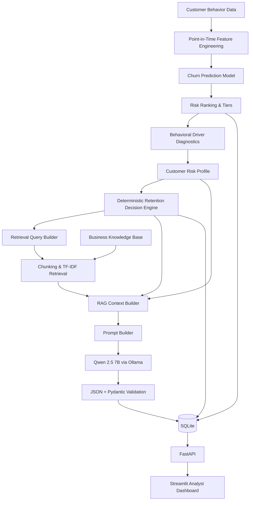

# AI Customer Churn Intelligence & Decision Support Platform

An end-to-end AI decision-support system for identifying customers at risk of churn, diagnosing behavioral risk signals, and generating grounded retention recommendations for an online learning platform.

The project combines temporal machine learning, behavioral diagnostics, deterministic business rules, retrieval-augmented generation (RAG), a local LLM, API services, persistent storage, and an analyst-facing dashboard.

## Overview

Customer churn prediction is only useful when a business can translate model output into an operational decision.

This project therefore goes beyond predicting churn probability. It builds a complete retention intelligence workflow:

```text
Customer Behavior Data
        ↓
Feature Engineering
        ↓
Churn Prediction
        ↓
Risk Ranking
        ↓
Behavioral Driver Diagnostics
        ↓
Retention Decision Engine
        ↓
RAG Knowledge Retrieval
        ↓
LLM Recommendation Generation
        ↓
FastAPI + SQLite
        ↓
Streamlit Analyst Dashboard
```

The system answers three practical questions:

1. **Who is most at risk of churn?**
2. **What behavioral signals are associated with that risk?**
3. **What retention action should the business take?**

## System Architecture



---

## Key Features

### Temporal Churn Modeling

Churn is defined using future behavioral decline across engagement dimensions while ensuring that future information is excluded from model features.

The modeling pipeline includes:

- rolling behavioral snapshots
- 60-day observation windows
- 30-day prediction horizons
- point-in-time feature construction
- leakage controls
- purged walk-forward validation
- Logistic Regression baseline
- HistGradientBoosting champion model

The production model prioritizes probability quality and operational usefulness rather than ranking performance alone.

### Risk-Based Retention Prioritization

Customers are ranked by predicted churn probability.

The operational segmentation policy is:

- **High Risk:** top 20%
- **Medium Risk:** next 30%
- **Low Risk:** remaining 50%

This converts model predictions into a capacity-aware retention queue rather than relying on an arbitrary probability threshold.

### Behavioral Driver Diagnostics

The system generates interpretable behavioral risk indicators across four domains:

- Engagement Decline
- Low Recent Engagement
- Inactivity / Recency
- Service Friction

These diagnostics summarize observable customer behavior and are not treated as causal explanations.

### Deterministic Retention Decision Engine

A rule-based decision layer maps the primary behavioral driver to a controlled retention strategy.

| Primary Driver | Recommended Action |
|---|---|
| Engagement Decline | Re-engagement Outreach |
| Low Recent Engagement | Personalized Learning Recommendation |
| Inactivity / Recency | Win-back Outreach |
| Service Friction | Priority Service Recovery |
| No Strong Risk Signal | Manual Risk Review |

The LLM is not allowed to override this action category.

### Retrieval-Augmented Generation

Business policies are stored in a controlled knowledge base covering:

- retention strategy
- engagement recovery
- service recovery
- offer and promotion policy

Markdown documents are chunked hierarchically and retrieved using TF-IDF semantic similarity.

The retrieved business knowledge is combined with customer-specific risk context before recommendation generation.

### Local LLM Recommendation Generation

The project uses **Qwen 2.5 7B through Ollama** for local recommendation generation.

The LLM produces structured retention recommendations containing:

- risk summary
- recommended action details
- secondary considerations
- supporting evidence
- policy rationale
- guardrails

Outputs are parsed as JSON and validated using Pydantic.

The architecture intentionally separates:

```text
Deterministic decision
        ↓
LLM explanation and personalization
```

This prevents the generative model from independently changing the retention strategy.

### RAG Reliability Evaluation

The RAG pipeline includes deterministic checks for:

- schema validity
- customer ID consistency
- deterministic action consistency
- evidence grounding
- policy source validity
- retrieved citation grounding
- restricted intervention tactics

A small driver-stratified evaluation achieved a 100% pass rate across four representative cases on these deterministic checks.

This result is treated as a pipeline validation result, not as a general measure of RAG accuracy.

### FastAPI Service

The application exposes API endpoints for:

- service health
- customer churn risk
- AI retention recommendations

Example endpoints:

```text
GET  /health
GET  /customers/{customer_id}/risk
POST /recommendations/{customer_id}
```

### SQLite Persistence and Recommendation Caching

Production outputs are persisted in SQLite:

```text
customer_risk
retention_decisions
recommendations
```

Generated recommendations are cached.

For an existing recommendation:

```text
API Request
    ↓
SQLite Cache Hit
    ↓
Validated Recommendation
```

For a new customer:

```text
API Request
    ↓
Cache Miss
    ↓
RAG + LLM Generation
    ↓
Pydantic Validation
    ↓
SQLite Persistence
    ↓
API Response
```

This avoids unnecessary repeated LLM inference.

### Streamlit Analyst Dashboard

The analyst interface provides:

- high-risk customer queue
- behavioral-driver filtering
- churn probability
- risk rank
- primary and secondary drivers
- AI-generated retention recommendations
- supporting customer evidence
- policy rationale
- recommendation guardrails

The dashboard communicates with the FastAPI service rather than implementing the intelligence pipeline directly in the UI.

---

## Model Evaluation

The final HistGradientBoosting model was evaluated using purged walk-forward validation.

In the latest evaluation fold:

| Metric | HistGradientBoosting |
|---|---:|
| ROC-AUC | 0.733 |
| PR-AUC | 0.466 |
| Log Loss | 0.485 |
| Brier Score | 0.158 |

Operational ranking performance improved as additional historical training data became available.

For the top 20% highest-risk customers, lift increased from approximately **1.38x to 2.00x** across walk-forward folds.

---

## Project Structure

```text
onemoreclass-churn-intelligence/
├── artifacts/
│   ├── decisions/
│   ├── evaluation/
│   ├── models/
│   ├── predictions/
│   └── recommendations/
├── data/
│   ├── database/
│   ├── processed/
│   └── raw/
├── knowledge/
├── notebooks/
├── scripts/
├── src/
│   ├── api/
│   ├── data/
│   ├── features/
│   ├── intelligence/
│   ├── modeling/
│   ├── persistence/
│   ├── rag/
│   └── ui/
├── tests/
├── pytest.ini
├── README.md
└── requirements.txt
```

---

## Technology Stack

**Data & ML**

- Python
- pandas
- NumPy
- scikit-learn
- Parquet

**AI / RAG**

- Qwen 2.5 7B
- Ollama
- TF-IDF retrieval
- Pydantic

**Application**

- FastAPI
- SQLite
- Streamlit

**Engineering**

- pytest
- modular Python package structure
- point-in-time feature engineering
- walk-forward model evaluation
- persistent model and prediction artifacts

---
## Running the Application

### 1. Create and activate a virtual environment

```bash
python -m venv .venv
source .venv/bin/activate
```

### 2. Install dependencies

```bash
pip install -r requirements.txt
```

### 3. Build the demo environment

Run the reproducible setup pipeline:

```bash
python -m scripts.setup_demo
```

This command automatically:

- generates the synthetic customer behavior data
- validates source data quality
- builds temporal churn labels
- constructs point-in-time modeling features
- evaluates the churn models
- trains the production scoring model
- scores customers and assigns risk tiers
- generates deterministic retention decisions
- initializes the SQLite database
- loads customer risk scores and retention decisions

### 4. Start the local LLM

The recommendation layer uses Qwen 2.5 7B through Ollama.

Install Ollama and pull the model if needed:

```bash
ollama pull qwen2.5:7b
```

Then start Ollama:

```bash
ollama serve
```

### 5. Start the FastAPI service

In a new terminal:

```bash
source .venv/bin/activate
uvicorn src.api.app:app --reload
```

API documentation is available at:

```text
http://127.0.0.1:8000/docs
```

### 6. Start the Streamlit dashboard

In another terminal:

```bash
source .venv/bin/activate
streamlit run src/ui/app.py
```

The dashboard is available at:

```text
http://localhost:8501
```

Generated LLM recommendations are persisted in SQLite and reused on subsequent requests.

## Testing

Run the automated test suite from the project root:

```bash
pytest -v
```

Tests cover core components including:

- risk-tier assignment
- retention action mapping
- customer profile construction
- FastAPI health and customer-risk endpoints

---

## Data

The project uses a synthetic dataset representing an online education platform.

The dataset includes:

- customer profiles
- daily learning activity
- course purchases
- payment outcomes
- promotions
- customer-service interactions
- complaints and refund requests

Synthetic data enables the complete ML and AI system to be demonstrated without exposing real customer information.

---

## Design Principles

The project follows several principles intended to make the system closer to a production decision-support application:

**Point-in-time correctness**  
Features use only information available at the scoring date.

**Temporal evaluation**  
Models are evaluated using purged walk-forward validation rather than random train/test splitting.

**Decision control**  
Business actions are determined by controlled logic rather than delegated entirely to an LLM.

**Grounded generation**  
The LLM receives customer evidence and retrieved business policies instead of generating recommendations from an unconstrained prompt.

**Structured outputs**  
Generated recommendations must satisfy a Pydantic schema.

**Persistent application state**  
Risk scores, decisions, and generated recommendations can be stored and queried through SQLite.

---

## Future Improvements

Potential production extensions include:

- embedding-based retrieval
- expanded RAG evaluation
- full-text factual-grounding checks
- cloud-hosted LLM provider abstraction
- experiment tracking and model registry
- scheduled scoring pipelines
- containerized deployment
- production database migration
